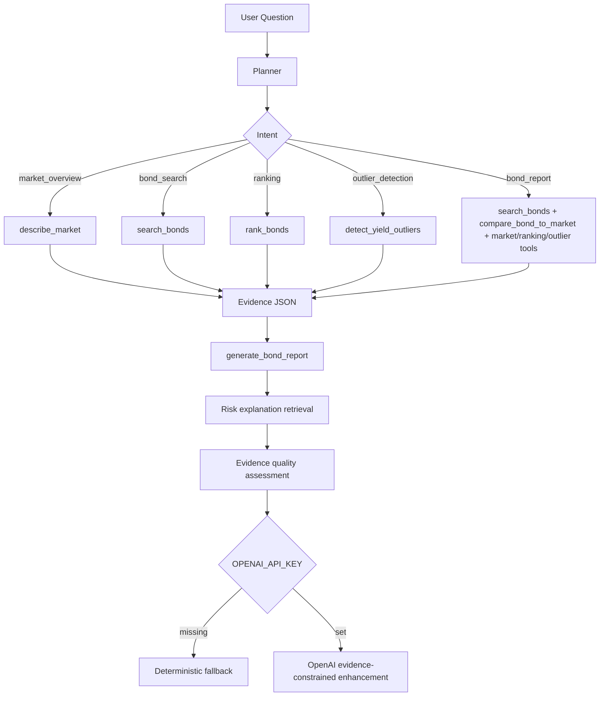

# BondLens AI

**Explainable Bond Analysis Agent**

[English](README.md) | [中文](README.zh-CN.md)


BondLens AI is a lightweight, evidence-grounded analysis agent for Chinese bond market sample data. It turns natural-language questions into local Python tool calls, then returns a structured answer with tool trace, data evidence, risk notes, and limitations.

> Non-investment advice. For learning, research, and portfolio demonstration only.


## Background

This project started as a 2024 undergraduate thesis project: a Flask-based bond data analysis system. The original thesis version is preserved and should not be rewritten:

- Legacy branch: `legacy-thesis-2024`
- Legacy tag: `thesis-submission-2024-04-24`
- Current branch: `main`

The current branch upgrades the thesis project into an AI Agent / LLM Application / AI Engineer portfolio project while keeping the historical origin visible.

## Repository Structure

This repository intentionally keeps two long-lived branches:

- `main`: the modern BondLens AI portfolio project
- `legacy-thesis-2024`: the original undergraduate thesis version

The legacy tag `thesis-submission-2024-04-24` points to the same preserved thesis-era commit.

## Why This Is An Agent, Not A Chatbot

BondLens AI does not ask an LLM to guess financial answers. The agent follows a small deterministic loop:

1. **Planner** classifies user intent and chooses tools.
2. **Tools** run local Python analysis over `data/testdata.xlsx`.
3. **Evidence** is attached to the response as structured JSON.
4. **Report** is generated from the evidence, with risks and limitations.
5. **Optional LLM** can polish the answer only after the local evidence exists.

If `OPENAI_API_KEY` is not set, the project still runs and uses deterministic fallback output.

## Core Capabilities

- Intent planning: market overview, bond search, ranking, outlier detection, full bond report
- Tool trace: each planner/tool step is visible in the Web page and API response
- Bond search by name, maturity, and yield range
- Market summary: sample count, yield distribution, volume statistics
- Ranking by yield, volume, maturity, or price
- Yield outlier detection with z-score
- Bond-to-market comparison: yield percentile, volume percentile, maturity percentile, outlier status
- Data source profile: explicit static-sample metadata and legacy crawler boundary
- Retrieval-augmented risk explanations for fixed-income concepts
- Evidence quality scoring with confidence and freshness labels
- Agent eval suite for repeatable behavior checks
- Docker deployment with gunicorn

## Agent Workflow



## Tool Trace Example

```text
User question: 搜索23附息国债26并给出收益率分析
-> planner(intent=bond_report)
-> search_bonds(name=23附息国债26)
-> compare_bond_to_market()
-> describe_market()
-> rank_bonds(by=yield, top_n=5)
-> detect_yield_outliers(method=zscore, threshold=3.0)
-> generate_bond_report()
-> final answer
```

## Tech Stack

- Python 3.11
- Flask
- Pandas / NumPy
- SciPy / Statsmodels / scikit-learn
- Plotly
- OpenPyXL
- OpenAI Python SDK, optional
- Pytest + local agent evals
- Docker Compose + gunicorn

## Architecture

```text
.
├── app.py                       # Flask app entry
├── bond_agent/
│   ├── agent.py                 # Agent orchestration and LLM fallback status
│   ├── planner.py               # Rule-based intent planner
│   ├── data_loader.py           # Excel loading and maturity normalization
│   ├── risk_knowledge.py        # Local fixed-income risk explanation retrieval
│   ├── evidence_quality.py      # Evidence scoring, freshness, and confidence labels
│   └── tools.py                 # Local bond analysis tools
├── data/testdata.xlsx           # Static bond sample data
├── evals/
│   ├── agent_eval_cases.yml     # Behavior cases
│   └── run_agent_evals.py       # Local eval runner
├── templates/agent.html         # Agent UI
├── tests/                       # Unit and smoke tests
├── Dockerfile
└── docker-compose.yml
```

## Quick Start With Docker

```bash
docker compose up --build
```

Open:

```text
http://localhost:5000/agent
```

The container runs gunicorn:

```bash
gunicorn -b 0.0.0.0:5000 app:app
```

The Compose service is named `bondlens-ai` and includes a healthcheck for `/agent`.

## Local Development

```bash
python -m pip install -r requirements-dev.txt
python app.py
```

Open:

```text
http://localhost:5000/agent
```

## Environment Variables

```bash
FLASK_ENV=production
SECRET_KEY=change-me-in-production
OPENAI_API_KEY=
OPENAI_MODEL=gpt-5.4-mini
```

- `SECRET_KEY`: Flask session secret.
- `OPENAI_API_KEY`: optional. If empty, deterministic fallback is used.
- `OPENAI_MODEL`: configurable model for evidence-constrained answer enhancement.

The API response exposes safe LLM state:

```json
{
  "used_llm": false,
  "llm_status": "disabled",
  "llm_error": null
}
```

## Example Questions

```text
当前样本收益率分布是什么样？
搜索23附息国债26并给出收益率分析
按收益率列出最高的前5只债券
按成交量列出最活跃的前5只债券
按期限列出最长的前5只债券
有没有收益率异常的债券？
筛选收益率大于 3 的债券
```

## API

```http
POST /api/agent/query
Content-Type: application/json

{
  "question": "搜索23附息国债26并给出收益率分析"
}
```

Key response fields:

- `plan`: planner intent, selected tools, ranking/search parameters
- `tools_used`: tools actually used for the answer
- `tool_trace`: human-readable step trace
- `data_evidence`: raw market/search/ranking/outlier/comparison evidence
- `data_source`: static Excel sample profile and legacy crawler boundary
- `risk_explanations`: retrieved fixed-income risk explanations
- `evidence_quality`: score, confidence labels, coverage, freshness, and penalties
- `final_answer`: report text
- `llm_status`: `disabled`, `success`, or `failed`

## Data Source Boundary

The current Agent path uses a single local static dataset:

```text
data/testdata.xlsx
```

The workbook contains more than 3,000 bond sample rows with fields such as bond name, maturity, clean price, closing yield, weighted yield, and trading volume. This is the only data source used by `bond_agent/`.

The legacy file `data/Crawler.py` is preserved as thesis-era historical code only. It targets old CNSTOCK news pages, depends on MongoDB and thesis-era text-analysis modules, and is not imported by the current Agent runtime. During repository verification on May 26, 2026, the old CNSTOCK HTTP endpoints returned `403 Forbidden` to automated requests, so this project does not present them as an active or reliable live data source.

## Risk Explanation Layer

BondLens AI includes a local retrieval-augmented explanation layer for fixed-income risk concepts. After the Python tools produce evidence, the Agent retrieves relevant snippets from a curated local knowledge base covering:

- yield interpretation
- liquidity risk
- maturity and duration sensitivity
- yield outlier review
- credit-context limitations
- static-data boundaries

This keeps explanations grounded and repeatable without requiring an external vector database or live LLM call.

## Evidence Quality

Every Agent answer includes an `evidence_quality` object with:

- `score`: 0-100 evidence quality score for the current answer
- `level`: low, medium, or high for static-sample analysis
- `analysis_confidence`: confidence in the descriptive analysis
- `decision_confidence`: intentionally low because no live market, issuer rating, credit event, or macro curve feed is attached
- `data_freshness`: currently `static_snapshot`
- `coverage`: which evidence blocks were available
- `penalties`: missing context that limits conclusions

## Agent Eval

Run deterministic behavior checks:

```bash
python evals/run_agent_evals.py
```

The eval suite checks:

- expected planner intent
- expected tools
- required answer keywords
- optional forbidden answer keywords

It does not call OpenAI.

## Tests

```bash
python -m pytest -q
```

Coverage includes:

- planner intent classification
- intent-aware tool routing
- data source metadata
- risk explanation retrieval
- evidence quality assessment
- market statistics
- ranking tools
- yield outlier detection
- bond-to-market comparison
- concrete bond report behavior
- LLM disabled/success/failed status with mocks
- Flask page/API smoke tests
- eval case loading

## Data Boundary

All financial conclusions are computed from project data:

```text
data/testdata.xlsx
```

The agent does not invent issuer ratings, credit events, macro views, or investment recommendations. Old crawler files remain historical context only; the current Agent path uses local static data only.

## Modern Project Cleanup

The `main` branch removes obvious IDE metadata and unreferenced legacy static dumps such as offline Angular docs and scraped `static/subject` pages. This is safe because:

- `legacy-thesis-2024` and `thesis-submission-2024-04-24` preserve the original repository state.
- Current Flask templates and static files do not reference the removed paths.
- Core data, templates, screenshots, CSS, JS, and images are retained.

## Interview Talking Points

- **Tool calling design:** deterministic planner maps user intent to local Python tools.
- **Evidence constraint:** final answers are generated from `data_evidence`, not free-form finance guessing.
- **Fallback design:** no API key required; OpenAI path is optional and observable.
- **Risk boundary:** output always includes limitations and non-investment-advice language.
- **Eval method:** local eval cases test intent, tool selection, and answer constraints.
- **Dockerization:** gunicorn runtime, healthcheck, and reproducible dependency install.
- **Legacy migration:** original thesis version preserved, modern branch cleaned for portfolio use.

## Roadmap

- Add GitHub Actions CI
- Add real-time AkShare data with explicit static-vs-live source labels
- Expand RAG from local snippets to document-backed retrieval
- Add PDF/Markdown report export
- Add richer agent evals for evidence consistency
- Add duration, convexity, credit spread, and liquidity buckets

## License

No explicit open-source license is currently declared. Keep the thesis origin and author context visible when using this project for learning, portfolio review, or interview discussion.

## Disclaimer

BondLens AI does not provide investment advice, trading advice, ratings opinions, or return guarantees. Outputs are for learning, research, and engineering demonstration only.
