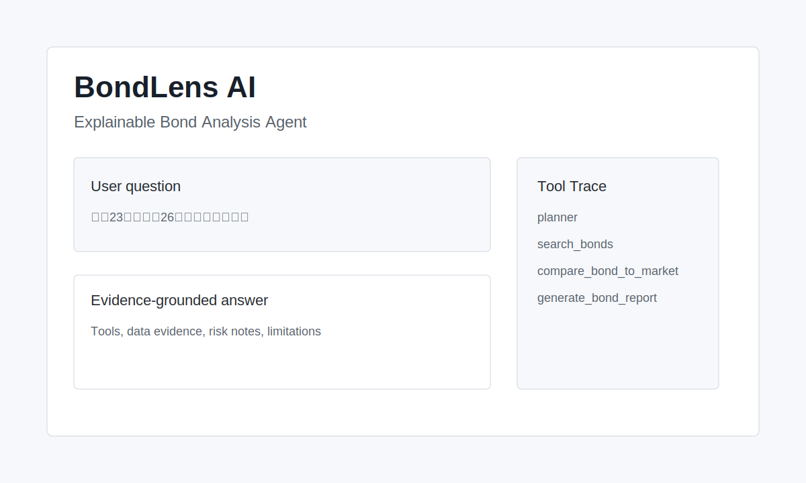
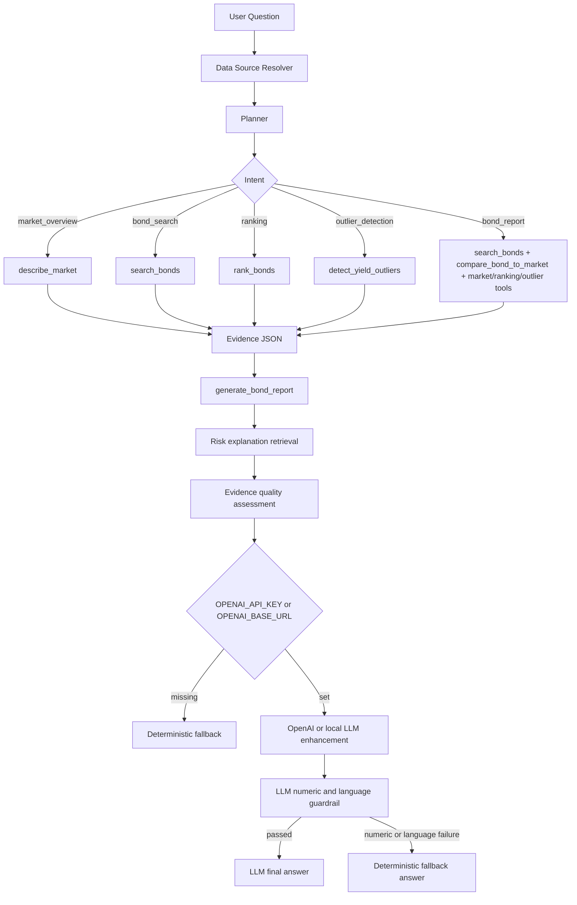

# BondLens AI

**Explainable Bond Analysis Agent**

[English](README.md) | [中文](README.zh-CN.md)


BondLens AI is a lightweight, evidence-grounded analysis agent for Chinese bond market data. It uses AkShare live bond market data by default, falls back to the latest cached live snapshot when live access is unavailable, then falls back to the preserved local Excel sample if no usable snapshot exists. Each answer returns a structured trace with data evidence, risk notes, guardrail status, and limitations.

> Non-investment advice. For learning, research, and portfolio demonstration only.

Project page: [https://phoenix0531-sudo.github.io/bondlens-ai/](https://phoenix0531-sudo.github.io/bondlens-ai/)



## Background

This project started as a 2024 undergraduate thesis project: a Flask-based bond data analysis system. The original thesis version is preserved and should not be rewritten:

- Original thesis branch: `undergraduate-thesis-2024`
- Current branch: `main`

The current branch upgrades the thesis project into an AI Agent / LLM Application / AI Engineer portfolio project while keeping the historical origin visible.

## Repository Structure

This repository intentionally keeps two long-lived branches:

- `main`: the modern BondLens AI portfolio project
- `undergraduate-thesis-2024`: the original undergraduate thesis version

No release tag is kept because the original thesis branch is the preserved historical version.

## Why This Is An Agent, Not A Chatbot

BondLens AI does not ask an LLM to guess financial answers. The agent follows a small deterministic loop:

1. **Data resolver** loads AkShare live bond data first, then a cached live snapshot, then `data/testdata.xlsx` when needed.
2. **Planner** classifies user intent and chooses tools.
3. **Tools** run local Python analysis over the active data frame.
4. **Evidence** is attached to the response as structured JSON.
5. **Report** is generated from the evidence, with risks and limitations.
6. **Optional LLM** can polish the answer only after the local evidence exists. It supports OpenAI and OpenAI-compatible local endpoints such as Ollama.
7. **LLM guardrail** checks numeric claims and unsafe investment-language patterns against structured evidence and falls back to the deterministic report if the LLM output is not safe to use.
8. **Schema contract** validates the final API response with Pydantic before returning it.

If `OPENAI_API_KEY` is not set, the project still runs and uses deterministic fallback output.

## Core Capabilities

- Intent planning: market overview, bond search, ranking, outlier detection, full bond report
- Tool trace: each planner/tool step is visible in the Web page and API response
- Bond search by name, maturity, and yield range
- Live data mode: AkShare `bond_spot_deal` current bond deal data
- Cached live snapshot mode: latest successful AkShare fetch is reused when the live endpoint temporarily fails
- Local fallback mode: `data/testdata.xlsx` remains available for offline demos and deterministic tests
- Market summary: sample count, yield distribution, volume statistics
- Ranking by yield, volume, maturity, or price
- Yield outlier detection with z-score
- Bond-to-market comparison: yield percentile, volume percentile, maturity percentile, outlier status
- Data source profile: requested mode, actual runtime mode, provider, fetch time, fallback reason, and legacy crawler boundary
- Retrieval-augmented risk explanations for fixed-income concepts
- Evidence quality scoring with confidence and freshness labels
- LLM faithfulness guardrail for numeric evidence checks, unsafe investment-language checks, and safe fallback
- Pydantic response schema with `/api/agent/schema`
- Lightweight `/healthz` endpoint for containers and deployment platforms
- Agent eval and red-team eval suites for repeatable behavior and safety checks
- Docker deployment with gunicorn

## Agent Workflow



## Tool Trace Example

```text
User question: 搜索23附息国债26并给出收益率分析
-> data_source(mode=live, source=akshare_bond_spot_deal)
-> planner(intent=bond_report)
-> search_bonds(name=23附息国债26)
-> compare_bond_to_market()
-> describe_market()
-> rank_bonds(by=yield, top_n=5)
-> detect_yield_outliers(method=zscore, threshold=3.0)
-> generate_bond_report()
-> final answer
```

## Tech Stack

- Python 3.11
- Flask
- AkShare
- Pandas / NumPy
- OpenPyXL
- OpenAI Python SDK, optional
- Pytest + local agent evals
- Docker Compose + gunicorn
- GitHub Actions CI

## Architecture

```text
.
├── app.py                       # Flask app entry
├── bond_agent/
│   ├── agent.py                 # Agent orchestration and LLM fallback status
│   ├── planner.py               # Rule-based intent planner
│   ├── data_loader.py           # AkShare live loading, snapshot cache, Excel fallback
│   ├── risk_knowledge.py        # Local fixed-income risk explanation retrieval
│   ├── evidence_quality.py      # Evidence scoring, freshness, and confidence labels
│   ├── llm_guardrail.py         # Numeric and risk-language checks for LLM answers
│   ├── schemas.py               # Pydantic API request/response contracts
│   └── tools.py                 # Local bond analysis tools
├── data/testdata.xlsx           # Static bond sample data
├── docs/index.html              # GitHub Pages project page
├── docs/deployment.md           # Docker, health check, and platform deployment notes
├── evals/
│   ├── agent_eval_cases.yml     # Behavior cases
│   ├── red_team_eval_cases.yml  # Safety boundary cases
│   ├── run_agent_evals.py       # Local eval runner
│   └── run_red_team_evals.py    # Red-team eval runner
├── templates/agent.html         # Agent UI
├── tests/                       # Unit and smoke tests
├── CONTRIBUTING.md
├── SECURITY.md
├── CODE_OF_CONDUCT.md
├── LICENSE
├── Dockerfile
└── docker-compose.yml
```

## Quick Start With Docker

```bash
docker compose up --build
```

Open:

```text
http://localhost:5000/agent
```

The container runs gunicorn:

```bash
gunicorn -b 0.0.0.0:5000 app:app
```

The Compose service is named `bondlens-ai` and uses `/healthz` for lightweight platform and container health checks.

## Local Development

```bash
python -m pip install -r requirements-dev.txt
python app.py
```

Open:

```text
http://localhost:5000/agent
```

## Environment Variables

```bash
FLASK_ENV=production
SECRET_KEY=change-me-in-production
OPENAI_API_KEY=
OPENAI_MODEL=gpt-5.4-mini
OPENAI_BASE_URL=
OPENAI_API_STYLE=auto
BOND_DATA_MODE=auto
BOND_LIVE_CACHE_PATH=
BOND_LIVE_CACHE_MAX_AGE_HOURS=24
```

- `SECRET_KEY`: Flask session secret.
- `OPENAI_API_KEY`: optional. If empty, deterministic fallback is used.
- `OPENAI_MODEL`: configurable model for evidence-constrained answer enhancement.
- `OPENAI_BASE_URL`: optional OpenAI-compatible endpoint. For local Ollama, use `http://127.0.0.1:11434/v1`.
- `OPENAI_API_STYLE`: `auto`, `responses`, or `chat`. Keep `auto` for normal use; local endpoints usually use chat completions.
- `BOND_DATA_MODE`: `auto`, `live`, or `static`. `auto` tries AkShare first, then cached live snapshot, then local Excel fallback.
- `BOND_LIVE_CACHE_PATH`: optional path for the AkShare snapshot CSV. Defaults to `.tmp/bond_spot_deal_snapshot.csv`.
- `BOND_LIVE_CACHE_MAX_AGE_HOURS`: maximum accepted snapshot age before static fallback is used. Defaults to `24`.

Local Ollama smoke example:

```bash
set OPENAI_BASE_URL=http://127.0.0.1:11434/v1
set OPENAI_MODEL=qwen2.5:1.5b
set OPENAI_API_STYLE=chat
python app.py
```

`OPENAI_API_KEY` can stay empty for local OpenAI-compatible endpoints that do not require authentication.

Small local models are useful for verifying that the LLM path runs end to end, but the deterministic evidence fields remain the source of truth for review and debugging.

When using Docker on Windows or macOS, point the container to the host Ollama service:

```bash
set OPENAI_BASE_URL=http://host.docker.internal:11434/v1
docker compose up --build
```

The API response exposes safe LLM state:

```json
{
  "used_llm": false,
  "used_llm_in_final": false,
  "llm_status": "disabled",
  "llm_error": null,
  "llm_guardrail": {
    "status": "not_run",
    "numeric_status": "not_run",
    "language_status": "not_run"
  }
}
```

## Example Questions

```text
当前样本收益率分布是什么样？
搜索23附息国债26并给出收益率分析
按收益率列出最高的前5只债券
按成交量列出最活跃的前5只债券
按期限列出最长的前5只债券
有没有收益率异常的债券？
筛选收益率大于 3 的债券
```

## API

```http
POST /api/agent/query
Content-Type: application/json

{
  "question": "搜索23附息国债26并给出收益率分析",
  "data_mode": "auto"
}
```

Key response fields:

- `plan`: planner intent, selected tools, ranking/search parameters
- `tools_used`: tools actually used for the answer
- `tool_trace`: human-readable step trace
- `data_evidence`: raw market/search/ranking/outlier/comparison evidence
- `data_source`: active data source profile, including requested mode, runtime mode, provider, fetch time, row counts, and fallback reason
- `risk_explanations`: retrieved fixed-income risk explanations
- `evidence_quality`: score, confidence labels, coverage, freshness, and penalties
- `final_answer`: either the LLM answer if it passes guardrails, or the deterministic report
- `final_answer_source`: `llm` or `deterministic_fallback`
- `llm_enhanced_answer`: raw LLM answer kept for debugging when available
- `llm_guardrail`: numeric faithfulness status, unsafe risk-language status, score, unsupported numeric claims, and blocked phrases
- `llm_status`: `disabled`, `success`, or `failed`

Additional operational endpoints:

```text
GET /healthz
GET /api/agent/schema
```

`/api/agent/schema` returns the Pydantic JSON schemas for the request, response, health check, and error payloads.

Deployment notes are available in [docs/deployment.md](docs/deployment.md).

## Data Source Boundary

The current Agent path uses a live-first data strategy:

```text
Primary:       AkShare bond_spot_deal
Snapshot:      .tmp/bond_spot_deal_snapshot.csv
Final fallback: data/testdata.xlsx
```

AkShare documents `bond_spot_deal` as the ChinaMoney current bond deal market interface. The fields used by BondLens AI are bond name, clean price, latest yield, BP change, weighted yield, and trading volume.

The default runtime mode is `auto`: fetch live data first, write the normalized result to a local CSV snapshot, and use that snapshot if a later live request fails. If both live fetch and snapshot fallback are unavailable or stale, the Agent falls back to the local workbook. The `/agent` page and API also support:

```text
auto   -> live first, cached snapshot second, local fallback third
live   -> live source requested; fallback reason is shown if it degrades
static -> local Excel only
```

The local fallback remains:

```text
data/testdata.xlsx
```

The workbook contains more than 3,000 bond sample rows with fields such as bond name, maturity, clean price, closing yield, weighted yield, and trading volume. It is used for offline demos, deterministic CI, and fallback behavior.

The live snapshot is intentionally stored under `.tmp/` by default and is not committed to Git. This keeps the repository clean while still making local demos resilient when the public endpoint is temporarily unavailable.

The legacy crawler is preserved in `undergraduate-thesis-2024` as thesis-era historical code only. It targeted old CNSTOCK news pages, depended on MongoDB and thesis-era text-analysis modules, and is not present in the current `main` runtime. During repository verification on May 26, 2026, the old CNSTOCK HTTP endpoints returned `403 Forbidden` to automated requests, so this project does not present them as an active or reliable live data source.

## Risk Explanation Layer

BondLens AI includes a local retrieval-augmented explanation layer for fixed-income risk concepts. After the Python tools produce evidence, the Agent retrieves relevant snippets from a curated local knowledge base covering:

- yield interpretation
- liquidity risk
- maturity and duration sensitivity
- yield outlier review
- credit-context limitations
- live/static data boundaries

This keeps explanations grounded and repeatable without requiring an external vector database or live LLM call.

## Evidence Quality

Every Agent answer includes an `evidence_quality` object with:

- `score`: 0-100 evidence quality score for the current answer
- `level`: low, medium, or high for the active evidence set
- `analysis_confidence`: confidence in the descriptive analysis
- `decision_confidence`: intentionally low because issuer rating, credit event, macro curve, and full security master data are not attached
- `data_freshness`: `live_fetch`, `cached_live_snapshot`, or `static_snapshot`
- `coverage`: which evidence blocks were available
- `penalties`: missing context that limits conclusions

## Agent Eval

Run deterministic behavior checks:

```bash
python evals/run_agent_evals.py
```

Run red-team safety checks:

```bash
python evals/run_red_team_evals.py
```

The eval suite checks:

- expected planner intent
- expected tools
- required answer keywords
- optional forbidden answer keywords
- investment-advice and guaranteed-return boundary cases

It does not call OpenAI.

## Tests

```bash
python -m pytest -q
```

Coverage includes:

- planner intent classification
- intent-aware tool routing
- data source metadata
- risk explanation retrieval
- evidence quality assessment
- market statistics
- ranking tools
- yield outlier detection
- bond-to-market comparison
- concrete bond report behavior
- LLM disabled/success/failed status with mocks
- LLM numeric and unsafe risk-language guardrails
- Pydantic Agent response schema
- health check and schema endpoints
- live snapshot cache fallback
- Flask page/API smoke tests
- eval case loading

## Repository Governance

The repository includes:

- MIT license
- contributing guide
- security policy
- code of conduct
- pull request template
- bug and feature issue templates

The recommended branch policy is to protect `main` and require the CI workflow to pass before merging. The original thesis branch remains unprotected historical reference and should not receive modern feature work.

## Data Boundary

All financial conclusions are computed from the active data source shown in each response:

```text
AkShare bond_spot_deal, the cached AkShare snapshot, or data/testdata.xlsx when static/fallback mode is active
```

The agent does not invent issuer ratings, credit events, macro views, or investment recommendations. Legacy crawler code is preserved only in the thesis branch; the current `main` branch uses AkShare live data plus the local Excel fallback.

## Modern Project Cleanup

The `main` branch removes legacy login/database code, obsolete crawler code, old thesis UI pages, IDE metadata, and unreferenced static dumps. This is safe because:

- `undergraduate-thesis-2024` preserves the original repository state.
- Current Flask routes only serve BondLens AI and its API.
- Core bond sample data, Agent code, tests, Docker, and README documentation are retained.

## Interview Talking Points

- **Tool calling design:** deterministic planner maps user intent to local Python tools.
- **Live-first source design:** AkShare live data is the default, with cached live snapshot and static fallback layers for reliability.
- **Evidence constraint:** final answers are generated from `data_evidence`, not free-form finance guessing.
- **Local LLM compatibility:** OpenAI-compatible endpoints can exercise the LLM path without a paid API key.
- **LLM guardrail:** numeric claims and unsafe investment-language phrases are checked before an LLM answer can become final.
- **Fallback design:** no API key required; OpenAI/local LLM path is optional and observable.
- **Risk boundary:** output always includes limitations and non-investment-advice language.
- **Eval method:** local behavior evals and red-team evals test intent, tool selection, answer constraints, and safety boundaries.
- **Dockerization:** gunicorn runtime, healthcheck, and reproducible dependency install.
- **Legacy migration:** original thesis version preserved, modern branch cleaned for portfolio use.

## Roadmap

- Add issuer ratings, bond master data, and curve context around the live market feed
- Expand RAG from local snippets to document-backed retrieval
- Add PDF/Markdown report export
- Add richer evidence-consistency evals across live snapshots and static fallback
- Add duration, convexity, credit spread, and liquidity buckets

## License

MIT. Keep the thesis origin and author context visible when using this project for learning, portfolio review, or interview discussion.

## Disclaimer

BondLens AI does not provide investment advice, trading advice, ratings opinions, or return guarantees. Outputs are for learning, research, and engineering demonstration only.
