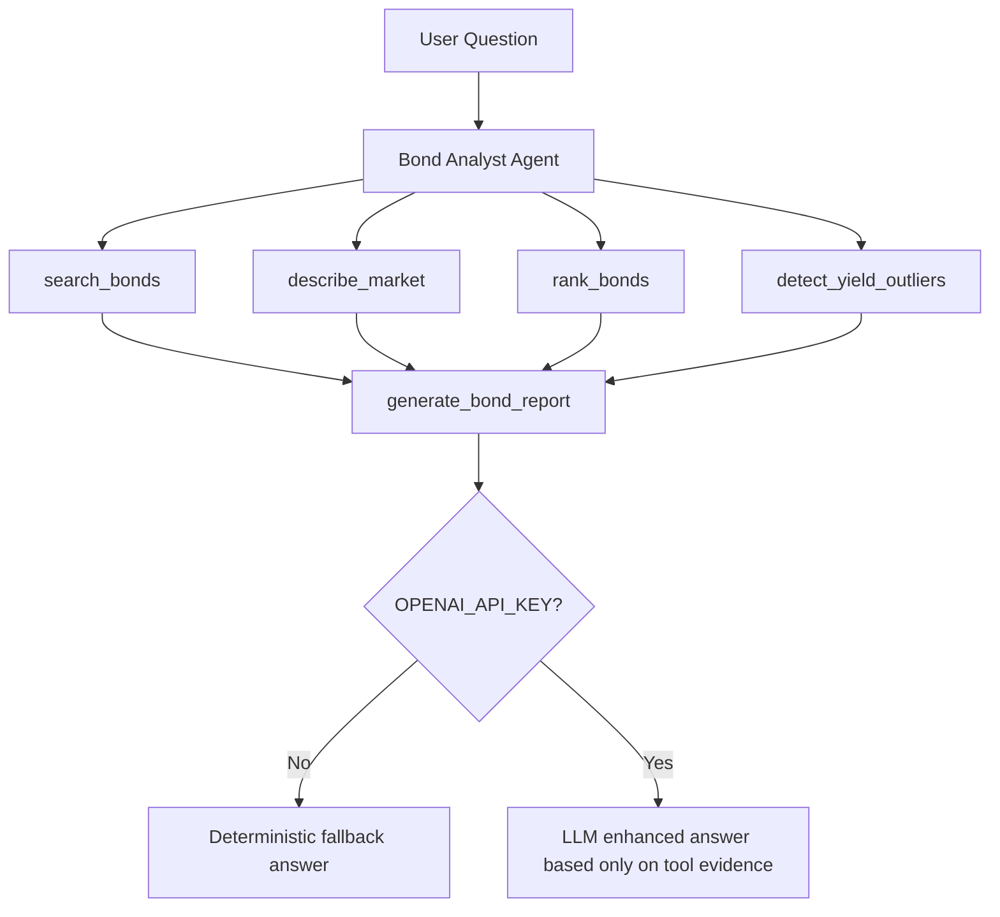

# AI Bond Analyst Agent

一个面向中国债券市场样本数据的可解释固定收益分析 Agent，支持自然语言查询、本地工具调用、收益率分析、异常检测、风险说明和结构化报告生成。

> 非投资建议，仅用于学习和研究。

## 项目背景

本项目源自 2024 年本科毕业设计“债券数据分析系统”。原始本科毕设版本已保留：

- 原版保护分支：`legacy-thesis-2024`
- 原版提交 tag：`thesis-submission-2024-04-24`
- 现代化开发分支：`modern-ai-bond-agent`

当前版本在不删除原始毕设痕迹的前提下，将旧 Flask 债券数据系统升级为一个适合 AI Agent / LLM Application / AI Engineer 岗位展示的作品集项目。

## 核心亮点

- 不是空泛聊天套壳：Agent 必须调用本地 Python 分析工具。
- 金融结论可追溯：所有分析基于 `data/testdata.xlsx` 真实样本计算。
- Tool Trace 可见：页面展示自然语言问题到工具调用再到最终回答的全过程。
- 无 API Key 可运行：默认使用 deterministic fallback 生成结构化报告。
- 可选 LLM 增强：设置 `OPENAI_API_KEY` 后使用 OpenAI Responses API 基于工具证据润色回答。
- 工程化交付：包含测试、Docker、环境变量示例和专业 README。

## Demo

现有本科毕设截图仍保留在 `readme_images/`：


Agent 页面访问：

```text
http://localhost:5000/agent
```

## 功能列表

- 债券简称、收益率、待偿期条件查询
- 市场样本概览：样本数量、收益率分布、成交量概览
- 债券排序：按收益率、成交量、期限、净价排序
- 收益率异常检测：默认 z-score 方法
- 结构化报告：Question、Tools Used、Data Evidence、Analysis、Risk Notes、Limitations
- Flask Web 页面和 JSON API
- Docker 一键启动

## Agent 工作流



## Tool Trace 示例

```text
User question: 搜索23附息国债26并给出收益率分析
-> search_bonds(name=23附息国债26)
-> describe_market()
-> rank_bonds(by=yield, top_n=5)
-> detect_yield_outliers(method=zscore, threshold=3.0)
-> generate_bond_report()
-> final answer
```

## 技术栈

- Python 3.11
- Flask
- Pandas / NumPy
- SciPy / Statsmodels / scikit-learn
- Plotly
- OpenPyXL
- OpenAI Python SDK（可选）
- Pytest
- Docker / Docker Compose

## 项目结构

```text
.
├── app.py                     # Flask 应用入口，保留旧页面并新增 Agent 页面/API
├── bond_agent/
│   ├── agent.py               # 单 Agent 编排、Tool Trace、OpenAI 可选增强
│   ├── data_loader.py         # Excel 数据加载、列名处理、待偿期解析
│   └── tools.py               # 本地债券分析工具
├── data/
│   └── testdata.xlsx          # 债券样本数据
├── templates/
│   └── agent.html             # Agent Web 页面
├── tests/                     # 最小测试套件
├── Dockerfile
├── docker-compose.yml
├── requirements.txt
└── requirements-dev.txt
```

## Quick Start：Docker

```bash
docker compose up --build
```

访问：

```text
http://localhost:5000
http://localhost:5000/agent
```

## 本地开发

```bash
python -m pip install -r requirements-dev.txt
python app.py
```

访问：

```text
http://localhost:5000/agent
```

也可以使用 Flask CLI：

```bash
flask --app app run --host 0.0.0.0 --port 5000
```

## 环境变量

复制 `.env.example` 后按需设置：

```bash
FLASK_ENV=production
SECRET_KEY=change-me-in-production
OPENAI_API_KEY=
OPENAI_MODEL=gpt-5.4-mini
```

说明：

- `SECRET_KEY`：Flask session 密钥，生产环境必须修改。
- `OPENAI_API_KEY`：为空时使用本地 deterministic fallback。
- `OPENAI_MODEL`：默认 `gpt-5.4-mini`，可按成本和效果自行配置。

## 示例问题

```text
找出收益率最高的债券，并说明是否有异常收益率样本。
搜索23附息国债26并给出收益率分析。
按成交量排序，列出最活跃的前5只债券。
当前样本的收益率分布是什么样？
期限最长的债券有哪些？
```

## 示例输出

```text
Question: 找出收益率最高的债券，并说明是否有异常收益率样本。

Tools Used:
- describe_market
- rank_bonds
- detect_yield_outliers
- generate_bond_report

Data Evidence:
- 样本数量: 3365
- 收益率摘要: mean / median / min / max 等统计量
- 排序字段: 收盘到期收益率(%)
- 异常样本数量: z-score 阈值下的异常数量

Analysis:
- 基于样本收益率、成交量和异常分数给出解释。

Risk Notes:
- 高收益可能对应信用、流动性、久期或估值波动风险。

Limitations:
- 仅基于项目内静态样本数据。
- 非投资建议，仅用于学习和研究。
```

## 测试方式

```bash
python -m pytest -q
```

当前测试覆盖：

- 数据加载和待偿期解析
- 市场统计工具
- 排序工具
- 收益率异常检测工具
- Agent fallback 输出
- Flask 关键路由 smoke test

## 数据说明

核心数据文件为：

```text
data/testdata.xlsx
```

当前 Agent 只使用项目内数据计算，不调用实时行情接口生成金融结论。`data/Crawler.py` 和旧静态资源属于原本科毕设遗留内容，暂不作为第一阶段 Agent 的运行依赖。

## API

```http
POST /api/agent/query
Content-Type: application/json

{
  "question": "找出收益率最高的债券"
}
```

返回字段包括：

- `agent`
- `question`
- `tools_used`
- `tool_trace`
- `data_evidence`
- `analysis`
- `risk_notes`
- `limitations`
- `final_answer`
- `used_llm`
- `disclaimer`

## Roadmap

- 接入 AkShare 实时债券/利率数据，并明确实时数据与静态样本的差异
- 增加 RAG：接入债券术语、评级说明、固定收益教材笔记
- 增加 Agent eval：固定问题集、工具调用正确性、证据一致性检查
- 导出 PDF/Markdown 债券分析报告
- 添加 GitHub Actions CI
- 增加更细的风险模型：久期、凸性、信用利差、流动性分层

## License 说明

当前仓库未声明明确开源许可证。用于学习、作品集展示或招聘沟通前请保留原作者和本科毕设来源说明；如需正式开源，建议后续补充 `LICENSE` 文件。

## 免责声明

本项目输出不构成任何投资建议、交易建议、评级意见或收益承诺。所有结果仅基于 `data/testdata.xlsx` 或项目内真实数据计算，用于学习、研究和工程展示。
