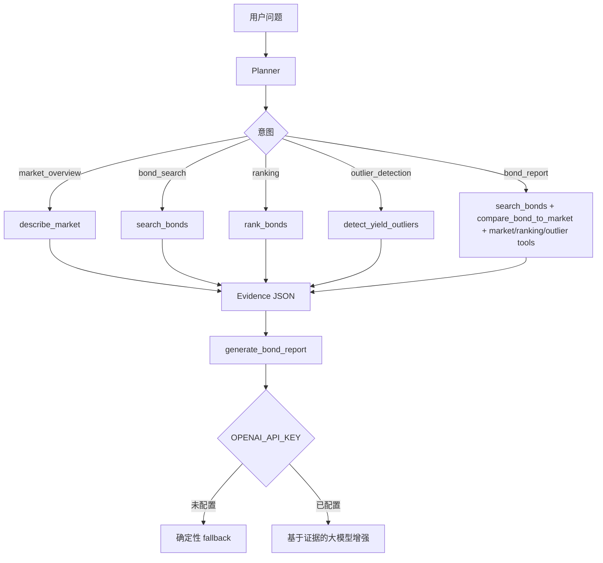

# BondLens AI

**可解释债券分析智能体**

[English](README.md) | [中文](README.zh-CN.md)

BondLens AI 是一个面向中文债券样本数据的轻量级、证据驱动分析智能体。它把自然语言问题转换成本地 Python 工具调用，并返回包含工具轨迹、数据证据、风险提示和能力边界的结构化回答。

> 本项目不提供投资建议，仅用于学习、研究、作品集展示和面试讨论。


## 项目背景

这个项目最初来自 2024 年本科毕业设计：一个基于 Flask 的债券数据分析系统。为了保留毕业设计的历史版本，原始提交没有被覆盖，而是单独保存在：

- 原版分支：`legacy-thesis-2024`
- 原版标签：`thesis-submission-2024-04-24`
- 当前分支：`main`

当前版本把原来的毕设项目升级为一个适合 AI Agent、LLM 应用和 AI Engineer 岗位展示的作品集项目，同时保留项目的历史来源。

## 仓库结构

这个仓库有意只保留两个长期分支：

- `main`：当前的 BondLens AI 作品集版本
- `legacy-thesis-2024`：本科毕业设计原始版本

标签 `thesis-submission-2024-04-24` 指向同一个被保留的毕设原始提交。

## 为什么这是 Agent，而不是普通聊天机器人

BondLens AI 不会让大模型直接猜金融结论。它使用一个小而清晰的确定性流程：

1. **Planner** 判断用户意图并选择工具。
2. **Tools** 基于 `data/testdata.xlsx` 执行本地 Python 分析。
3. **Evidence** 把分析结果组织成结构化 JSON。
4. **Report** 基于证据生成报告，并明确风险和限制。
5. **Optional LLM** 只在本地证据已经生成之后，对回答进行可选增强。

如果没有配置 `OPENAI_API_KEY`，项目仍然可以运行，并使用确定性的 fallback 输出。

## 核心能力

- 意图规划：市场概览、债券搜索、排序、异常检测、完整债券报告
- 工具轨迹：Web 页面和 API 响应都可以看到实际调用过的 planner/tool 步骤
- 债券搜索：支持名称、期限、收益率范围
- 市场概览：样本数量、收益率分布、成交量统计
- 债券排序：支持收益率、成交量、期限、价格
- 收益率异常检测：基于 z-score 识别异常样本
- 单债对比市场：收益率分位、成交量分位、期限分位、异常状态
- Agent eval：用本地评测用例验证工具选择和回答约束
- Docker 部署：使用 gunicorn 和 Docker Compose

## Agent 工作流



## 工具轨迹示例

```text
User question: 搜索23附息国债26并给出收益率分析
-> planner(intent=bond_report)
-> search_bonds(name=23附息国债26)
-> compare_bond_to_market()
-> describe_market()
-> rank_bonds(by=yield, top_n=5)
-> detect_yield_outliers(method=zscore, threshold=3.0)
-> generate_bond_report()
-> final answer
```

## 技术栈

- Python 3.11
- Flask
- Pandas / NumPy
- SciPy / Statsmodels / scikit-learn
- Plotly
- OpenPyXL
- OpenAI Python SDK，可选
- Pytest + 本地 Agent eval
- Docker Compose + gunicorn

## 项目结构

```text
.
├── app.py                       # Flask 应用入口
├── bond_agent/
│   ├── agent.py                 # Agent 编排和 LLM fallback 状态
│   ├── planner.py               # 规则意图规划器
│   ├── data_loader.py           # Excel 加载和期限字段标准化
│   └── tools.py                 # 本地债券分析工具
├── data/testdata.xlsx           # 静态债券样本数据
├── evals/
│   ├── agent_eval_cases.yml     # 行为评测用例
│   └── run_agent_evals.py       # 本地评测入口
├── templates/agent.html         # Agent 页面
├── tests/                       # 单元测试和 smoke tests
├── Dockerfile
└── docker-compose.yml
```

## 使用 Docker 快速启动

```bash
docker compose up --build
```

打开：

```text
http://localhost:5000/agent
```

容器内使用 gunicorn 启动：

```bash
gunicorn -b 0.0.0.0:5000 app:app
```

Docker Compose 服务名为 `bondlens-ai`，并为 `/agent` 配置了 healthcheck。

## 本地开发

```bash
python -m pip install -r requirements-dev.txt
python app.py
```

打开：

```text
http://localhost:5000/agent
```

## 环境变量

```bash
FLASK_ENV=production
SECRET_KEY=change-me-in-production
OPENAI_API_KEY=
OPENAI_MODEL=gpt-5.4-mini
```

- `SECRET_KEY`：Flask session 密钥。
- `OPENAI_API_KEY`：可选。为空时使用确定性 fallback。
- `OPENAI_MODEL`：用于基于证据增强回答的可配置模型。

API 响应会暴露安全的 LLM 状态：

```json
{
  "used_llm": false,
  "llm_status": "disabled",
  "llm_error": null
}
```

## 示例问题

```text
当前样本收益率分布是什么样？
搜索23附息国债26并给出收益率分析
按收益率列出最高的前5只债券
按成交量列出最活跃的前5只债券
按期限列出最长的前5只债券
有没有收益率异常的债券？
筛选收益率大于 3 的债券
```

## API

```http
POST /api/agent/query
Content-Type: application/json

{
  "question": "搜索23附息国债26并给出收益率分析"
}
```

关键响应字段：

- `plan`：planner 意图、选择的工具、排序/搜索参数
- `tools_used`：本次回答实际使用的工具
- `tool_trace`：可读的工具执行轨迹
- `data_evidence`：市场、搜索、排序、异常、单债对比等结构化证据
- `final_answer`：最终报告文本
- `llm_status`：`disabled`、`success` 或 `failed`

## Agent Eval

运行确定性行为评测：

```bash
python evals/run_agent_evals.py
```

评测内容包括：

- 预期 planner 意图
- 预期工具调用
- 回答中必须出现的关键词
- 回答中不能出现的关键词

评测不会调用 OpenAI。

## 测试

```bash
python -m pytest -q
```

测试覆盖：

- planner 意图分类
- 基于意图的工具路由
- 市场统计
- 排序工具
- 收益率异常检测
- 单债对比市场
- 具体债券报告行为
- LLM disabled/success/failed 状态及 mock
- Flask 页面/API smoke tests
- eval case 加载

## 数据边界

所有金融结论都来自项目内置数据：

```text
data/testdata.xlsx
```

Agent 不会编造发行人评级、信用事件、宏观判断或投资建议。旧爬虫文件仅作为历史项目背景；当前 Agent 路径只使用本地静态数据。

## 当前版本清理说明

`main` 分支删除了明显的 IDE 元数据和未引用的历史静态资源，例如离线 Angular 文档和抓取页面。这是安全的，因为：

- `legacy-thesis-2024` 和 `thesis-submission-2024-04-24` 保留了原始仓库状态。
- 当前 Flask templates 和 static 文件没有引用这些被删除的路径。
- 核心数据、模板、截图、CSS、JS 和图片被保留。

## 面试讲解要点

- **工具调用设计**：确定性 planner 把用户意图映射到本地 Python 工具。
- **证据约束**：最终回答来自 `data_evidence`，不是让大模型自由发挥金融判断。
- **Fallback 设计**：没有 API key 也能运行；OpenAI 路径是可选且可观测的。
- **风险边界**：输出始终包含限制说明和非投资建议边界。
- **Eval 方法**：本地 eval cases 检查意图、工具选择和回答约束。
- **Docker 化**：gunicorn runtime、healthcheck、可复现依赖安装。
- **Legacy migration**：保留本科毕设原版，同时把现代版本清理成作品集项目。

## Roadmap

- 添加 GitHub Actions CI
- 接入实时 AkShare 数据，并明确静态数据与实时数据来源
- 为债券术语和固收风险概念增加 RAG
- 支持 PDF/Markdown 报告导出
- 扩展 Agent eval，增加证据一致性检查
- 增加久期、凸性、信用利差和流动性分层

## License

当前未声明明确开源许可证。将本项目用于学习、作品集或面试讨论时，请保留本科毕设来源和作者上下文。

## Disclaimer

BondLens AI 不提供投资建议、交易建议、评级意见或收益保证。输出内容仅用于学习、研究和工程能力展示。
