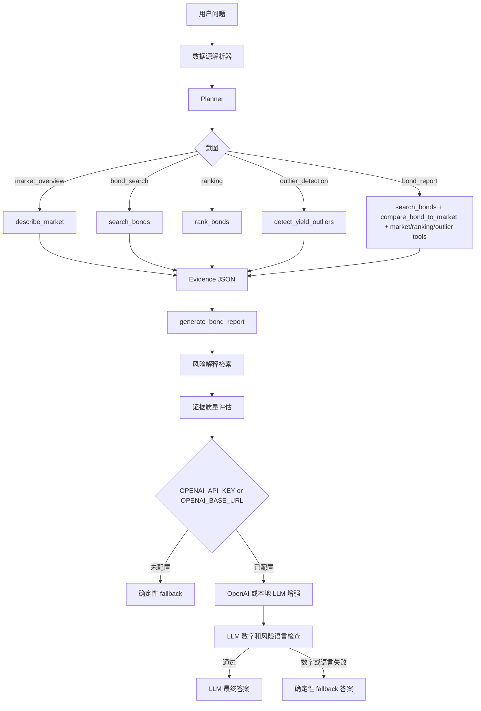

# BondLens AI

**可解释债券分析智能体**

[English](README.md) | [中文](README.zh-CN.md)


BondLens AI 是一个面向中文债券市场数据的轻量级、证据驱动分析智能体。它默认优先使用 AkShare 实时债券行情，实时接口不可用时先降级到最近一次成功获取的实时快照；如果快照也不可用，再降级到保留的本地 Excel 样本。每次回答都会返回工具轨迹、数据证据、风险提示、guardrail 状态和能力边界。

> 本项目不提供投资建议，仅用于学习、研究、作品集展示和面试讨论。

项目主页：[https://phoenix0531-sudo.github.io/bondlens-ai/](https://phoenix0531-sudo.github.io/bondlens-ai/)


## 项目背景

这个项目最初来自 2024 年本科毕业设计：一个基于 Flask 的债券数据分析系统。为了保留毕业设计的历史版本，原始提交没有被覆盖，而是单独保存在：

- 本科毕设原版分支：`undergraduate-thesis-2024`
- 当前分支：`main`

当前版本把原来的毕设项目升级为一个适合 AI Agent、LLM 应用和 AI Engineer 岗位展示的作品集项目，同时保留项目的历史来源。

## 仓库结构

这个仓库有意只保留两个长期分支：

- `main`：当前的 BondLens AI 作品集版本
- `undergraduate-thesis-2024`：本科毕业设计原始版本

因为本科毕设原版分支已经作为固定历史版本保留，所以当前不再额外保留 release tag。

## 为什么这是 Agent，而不是普通聊天机器人

BondLens AI 不会让大模型直接猜金融结论。它使用一个小而清晰的确定性流程：

1. **Data resolver** 优先加载 AkShare 实时债券数据，失败时先使用实时快照，再降级到 `data/testdata.xlsx`。
2. **Planner** 判断用户意图并选择工具。
3. **Tools** 基于当前激活的数据表执行本地 Python 分析。
4. **Evidence** 把分析结果组织成结构化 JSON。
5. **Report** 基于证据生成报告，并明确风险和限制。
6. **Optional LLM** 只在本地证据已经生成之后，对回答进行可选增强。它支持 OpenAI，也支持 Ollama 这类 OpenAI-compatible 本地接口。
7. **LLM guardrail** 会把大模型输出里的数字和不安全投资语言与规则做比对；如果出现证据外数字、买卖建议、收益保证或过度安全表述，最终答案自动回退到确定性报告。
8. **Schema contract** 使用 Pydantic 校验最终 API 响应结构，再返回给调用方。

如果没有配置 `OPENAI_API_KEY`，项目仍然可以运行，并使用确定性的 fallback 输出。

## 核心能力

- 意图规划：市场概览、债券搜索、排序、异常检测、完整债券报告
- 工具轨迹：Web 页面和 API 响应都可以看到实际调用过的 planner/tool 步骤
- 债券搜索：支持名称、期限、收益率范围
- 实时数据模式：通过 AkShare `bond_spot_deal` 获取现券市场成交行情
- 实时快照模式：实时接口临时失败时复用最近一次成功 AkShare 请求的规范化快照
- 本地备用模式：`data/testdata.xlsx` 仍用于离线演示和确定性测试
- 市场概览：样本数量、收益率分布、成交量统计
- 债券排序：支持收益率、成交量、期限、价格
- 收益率异常检测：基于 z-score 识别异常样本
- 单债对比市场：收益率分位、成交量分位、期限分位、异常状态
- 数据源画像：展示请求模式、实际运行模式、数据提供方、获取时间、降级原因和旧爬虫边界
- 风险解释检索：为固收风险概念提供本地 RAG 式解释
- 证据质量评分：展示置信度、数据新鲜度和缺失上下文
- LLM 事实一致性检查：检查数字证据和不安全投资语言，失败时安全回退
- Pydantic 响应结构合约，并通过 `/api/agent/schema` 暴露
- 轻量 `/healthz` 健康检查，适合 Docker 和部署平台
- Agent eval 和红队 eval：用本地评测用例验证工具选择、回答约束和安全边界
- Docker 部署：使用 gunicorn 和 Docker Compose

## Agent 工作流



## 工具轨迹示例

```text
User question: 搜索23附息国债26并给出收益率分析
-> data_source(mode=live, source=akshare_bond_spot_deal)
-> planner(intent=bond_report)
-> search_bonds(name=23附息国债26)
-> compare_bond_to_market()
-> describe_market()
-> rank_bonds(by=yield, top_n=5)
-> detect_yield_outliers(method=zscore, threshold=3.0)
-> generate_bond_report()
-> final answer
```

## 技术栈

- Python 3.11
- Flask
- AkShare
- Pandas / NumPy
- OpenPyXL
- OpenAI Python SDK，可选
- Pytest + 本地 Agent eval
- Docker Compose + gunicorn
- GitHub Actions CI

## 项目结构

```text
.
├── app.py                       # Flask 应用入口
├── bond_agent/
│   ├── agent.py                 # Agent 编排和 LLM fallback 状态
│   ├── planner.py               # 规则意图规划器
│   ├── data_loader.py           # AkShare 实时加载、快照缓存和 Excel 备用
│   ├── risk_knowledge.py        # 本地固收风险解释检索
│   ├── evidence_quality.py      # 证据评分、数据新鲜度和置信度标签
│   ├── llm_guardrail.py         # LLM 数字和风险语言检查
│   ├── schemas.py               # Pydantic API 请求/响应结构合约
│   └── tools.py                 # 本地债券分析工具
├── data/testdata.xlsx           # 静态债券样本数据
├── docs/index.html              # GitHub Pages 项目主页
├── docs/deployment.md           # Docker、健康检查和平台部署说明
├── evals/
│   ├── agent_eval_cases.yml     # 行为评测用例
│   ├── red_team_eval_cases.yml  # 安全边界评测用例
│   ├── run_agent_evals.py       # 本地评测入口
│   └── run_red_team_evals.py    # 红队评测入口
├── templates/agent.html         # Agent 页面
├── tests/                       # 单元测试和 smoke tests
├── CONTRIBUTING.md
├── SECURITY.md
├── CODE_OF_CONDUCT.md
├── LICENSE
├── Dockerfile
└── docker-compose.yml
```

## 使用 Docker 快速启动

```bash
docker compose up --build
```

打开：

```text
http://localhost:5000/agent
```

容器内使用 gunicorn 启动：

```bash
gunicorn -b 0.0.0.0:5000 app:app
```

Docker Compose 服务名为 `bondlens-ai`，并使用 `/healthz` 作为轻量 healthcheck。

## 本地开发

```bash
python -m pip install -r requirements-dev.txt
python app.py
```

打开：

```text
http://localhost:5000/agent
```

## 环境变量

```bash
FLASK_ENV=production
SECRET_KEY=change-me-in-production
OPENAI_API_KEY=
OPENAI_MODEL=gpt-5.4-mini
OPENAI_BASE_URL=
OPENAI_API_STYLE=auto
BOND_DATA_MODE=auto
BOND_LIVE_CACHE_PATH=
BOND_LIVE_CACHE_MAX_AGE_HOURS=24
```

- `SECRET_KEY`：Flask session 密钥。
- `OPENAI_API_KEY`：可选。为空时使用确定性 fallback。
- `OPENAI_MODEL`：用于基于证据增强回答的可配置模型。
- `OPENAI_BASE_URL`：可选的 OpenAI-compatible endpoint。本地 Ollama 可使用 `http://127.0.0.1:11434/v1`。
- `OPENAI_API_STYLE`：`auto`、`responses` 或 `chat`。普通使用保持 `auto`；本地模型通常走 chat completions。
- `BOND_DATA_MODE`：`auto`、`live` 或 `static`。`auto` 会优先请求 AkShare，然后使用实时快照，最后使用本地 Excel 备用数据。
- `BOND_LIVE_CACHE_PATH`：可选的 AkShare 快照 CSV 路径，默认是 `.tmp/bond_spot_deal_snapshot.csv`。
- `BOND_LIVE_CACHE_MAX_AGE_HOURS`：实时快照最大可接受年龄，超过后使用静态兜底，默认 `24` 小时。

本地 Ollama smoke 示例：

```bash
set OPENAI_BASE_URL=http://127.0.0.1:11434/v1
set OPENAI_MODEL=qwen2.5:1.5b
set OPENAI_API_STYLE=chat
python app.py
```

如果本地 OpenAI-compatible endpoint 不要求鉴权，`OPENAI_API_KEY` 可以留空。

小参数本地模型更适合验证 LLM 链路是否跑通；面试展示和调试时，结构化 `data_evidence` 仍然是事实来源。

如果用 Docker 在 Windows 或 macOS 上连接宿主机 Ollama，需要把 endpoint 指向宿主机：

```bash
set OPENAI_BASE_URL=http://host.docker.internal:11434/v1
docker compose up --build
```

API 响应会暴露安全的 LLM 状态：

```json
{
  "used_llm": false,
  "used_llm_in_final": false,
  "llm_status": "disabled",
  "llm_error": null,
  "llm_guardrail": {
    "status": "not_run",
    "numeric_status": "not_run",
    "language_status": "not_run"
  }
}
```

## 示例问题

```text
当前样本收益率分布是什么样？
搜索23附息国债26并给出收益率分析
按收益率列出最高的前5只债券
按成交量列出最活跃的前5只债券
按期限列出最长的前5只债券
有没有收益率异常的债券？
筛选收益率大于 3 的债券
```

## API

```http
POST /api/agent/query
Content-Type: application/json

{
  "question": "搜索23附息国债26并给出收益率分析",
  "data_mode": "auto"
}
```

关键响应字段：

- `plan`：planner 意图、选择的工具、排序/搜索参数
- `tools_used`：本次回答实际使用的工具
- `tool_trace`：可读的工具执行轨迹
- `data_evidence`：市场、搜索、排序、异常、单债对比等结构化证据
- `data_source`：当前激活的数据源画像，包括请求模式、实际运行模式、数据提供方、获取时间、行数和降级原因
- `risk_explanations`：检索到的固收风险解释
- `evidence_quality`：评分、置信度、覆盖范围、数据新鲜度和缺失上下文
- `final_answer`：通过 guardrail 的 LLM 答案，或确定性工具报告
- `final_answer_source`：`llm` 或 `deterministic_fallback`
- `llm_enhanced_answer`：可用时保留原始 LLM 输出，便于调试
- `llm_guardrail`：数字事实一致性状态、风险语言状态、评分、证据外数字和被拦截短语
- `llm_status`：`disabled`、`success` 或 `failed`

其他运维端点：

```text
GET /healthz
GET /api/agent/schema
```

`/api/agent/schema` 返回请求、响应、健康检查和错误 payload 的 Pydantic JSON Schema。

部署说明见 [docs/deployment.md](docs/deployment.md)。

## 数据源边界

当前 Agent 路径使用“实时优先、多层兜底”的数据策略：

```text
主数据源：AkShare bond_spot_deal
实时快照：.tmp/bond_spot_deal_snapshot.csv
最终兜底：data/testdata.xlsx
```

AkShare 文档将 `bond_spot_deal` 描述为中国货币网现券市场成交行情接口。BondLens AI 使用其中的债券简称、成交净价、最新收益率、BP 涨跌、加权收益率和交易量字段。

默认运行模式是 `auto`：先请求实时数据，并把规范化结果写入本地 CSV 快照；如果后续实时请求失败，就先使用这个快照。如果实时请求和快照都不可用或已过期，Agent 才会降级到本地 Excel。`/agent` 页面和 API 也支持：

```text
auto   -> 实时优先，快照第二，本地第三
live   -> 请求实时源；如果降级，会展示原因
static -> 只使用本地 Excel
```

本地备用数据仍然保留：

```text
data/testdata.xlsx
```

这个 Excel 文件包含 3,000 多条债券样本记录，字段包括债券简称、待偿期、收盘净价、收盘到期收益率、加权收益率和交易量。它用于离线演示、确定性 CI 和实时接口失败时的兜底。

实时快照默认存放在 `.tmp/` 下，不提交到 Git。这样仓库保持干净，同时本地演示在公共接口临时不可用时仍然有一层接近实时的数据兜底。

旧爬虫代码只保存在 `undergraduate-thesis-2024` 分支，作为本科毕设时期的历史代码保留。它面向旧的 CNSTOCK 新闻页面，依赖 MongoDB 和当时的文本分析模块，当前 `main` 运行路径不包含、不会导入、也不会调用它。仓库核对时，旧 CNSTOCK HTTP 接口在 2026 年 5 月 26 日对自动请求返回 `403 Forbidden`，因此本项目不会把它描述成仍然可用或可靠的实时数据源。

## 风险解释层

BondLens AI 增加了一个本地检索增强的固收风险解释层。Python 工具先生成数据证据，然后 Agent 会从本地知识片段中检索相关解释，覆盖：

- 收益率解释
- 流动性风险
- 期限和久期敏感性
- 收益率异常复核
- 信用上下文限制
- 实时/静态数据边界

这样即使不调用外部向量数据库或实时大模型，回答也能展示“工具产生事实，检索层解释风险，LLM 可选润色”的 Agent 结构。

## 证据质量

每次 Agent 回答都会包含 `evidence_quality` 对象：

- `score`：当前回答的 0-100 证据质量评分
- `level`：针对当前证据集的 low、medium 或 high
- `analysis_confidence`：对描述性分析的置信度
- `decision_confidence`：刻意保持 low，因为项目尚未接入主体评级、信用事件、宏观利率曲线和完整债券主数据
- `data_freshness`：可能是 `live_fetch`、`cached_live_snapshot` 或 `static_snapshot`
- `coverage`：本次回答可用的证据块
- `penalties`：限制结论强度的缺失上下文

## Agent Eval

运行确定性行为评测：

```bash
python evals/run_agent_evals.py
```

运行红队安全评测：

```bash
python evals/run_red_team_evals.py
```

评测内容包括：

- 预期 planner 意图
- 预期工具调用
- 回答中必须出现的关键词
- 回答中不能出现的关键词
- 买卖建议、收益保证和过度安全表述等安全边界

评测不会调用 OpenAI。

## 测试

```bash
python -m pytest -q
```

测试覆盖：

- planner 意图分类
- 基于意图的工具路由
- 数据源元信息
- 风险解释检索
- 证据质量评估
- 市场统计
- 排序工具
- 收益率异常检测
- 单债对比市场
- 具体债券报告行为
- LLM disabled/success/failed 状态及 mock
- LLM 数字和风险语言 guardrail
- Pydantic Agent 响应结构
- 健康检查和 schema endpoint
- 实时快照缓存兜底
- Flask 页面/API smoke tests
- eval case 加载

## 仓库治理

当前仓库已补齐：

- MIT license
- 贡献指南
- 安全策略
- 行为准则
- Pull request 模板
- Bug 和 feature issue 模板

建议保护 `main` 分支，并要求 CI 通过后再合并。`undergraduate-thesis-2024` 是本科毕设历史分支，不建议继续追加现代功能。

## 数据边界

所有金融结论都来自每次响应中标明的当前激活数据源：

```text
AkShare bond_spot_deal、AkShare 实时快照，或 static/fallback 模式下的 data/testdata.xlsx
```

Agent 不会编造发行人评级、信用事件、宏观判断或投资建议。旧爬虫代码只保存在本科毕设分支；当前 `main` 分支使用 AkShare 实时数据和本地 Excel 备用数据。

## 当前版本清理说明

`main` 分支删除了旧登录/数据库代码、旧爬虫代码、旧毕设页面、明显的 IDE 元数据和未引用的历史静态资源。这是安全的，因为：

- `undergraduate-thesis-2024` 保留了原始仓库状态。
- 当前 Flask 路由只服务 BondLens AI 页面和 API。
- 核心债券样本数据、Agent 代码、测试、Docker 和 README 文档被保留。

## 面试讲解要点

- **工具调用设计**：确定性 planner 把用户意图映射到本地 Python 工具。
- **实时优先数据源设计**：默认接入 AkShare 实时行情，同时保留实时快照和静态数据两层兜底。
- **证据约束**：最终回答来自 `data_evidence`，不是让大模型自由发挥金融判断。
- **Fallback 设计**：没有 API key 也能运行；OpenAI 路径是可选且可观测的。
- **本地模型兼容**：OpenAI-compatible endpoint 可以在没有付费 API key 的情况下跑通 LLM 路径。
- **LLM guardrail**：大模型输出里的数字和不安全投资语言都必须通过检查，才能成为最终答案。
- **风险边界**：输出始终包含限制说明和非投资建议边界。
- **Eval 方法**：本地行为 eval 和红队 eval 检查意图、工具选择、回答约束和安全边界。
- **Docker 化**：gunicorn runtime、healthcheck、可复现依赖安装。
- **Legacy migration**：保留本科毕设原版，同时把现代版本清理成作品集项目。

## Roadmap

- 增加发行人评级、债券主数据和利率曲线上下文
- 把本地风险解释片段扩展为文档级 RAG
- 支持 PDF/Markdown 报告导出
- 扩展 live snapshot 与 static fallback 之间的证据一致性评测
- 增加久期、凸性、信用利差和流动性分层

## License

MIT。将本项目用于学习、作品集或面试讨论时，请保留本科毕设来源和作者上下文。

## Disclaimer

BondLens AI 不提供投资建议、交易建议、评级意见或收益保证。输出内容仅用于学习、研究和工程能力展示。
